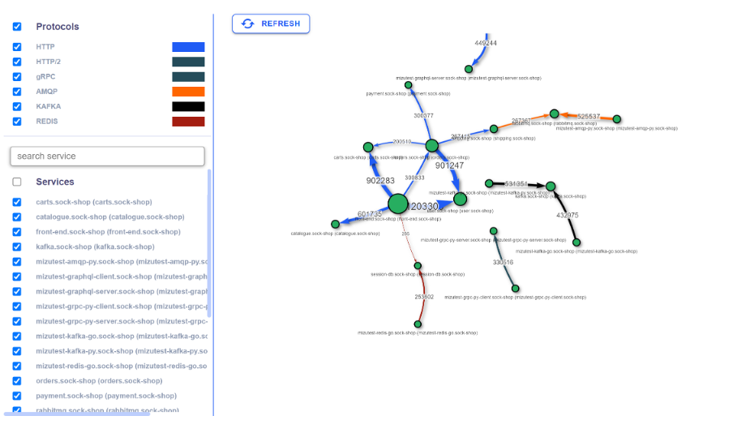

# Ebpf 容器安全调研

## 网络监控方案调研

### Mizu：

**Mizu** 能监控k8s集群里面基于TCP协议的多种应用协议的api通信过程，并且能够抓取详细的数据包。类似于docker的Tcpdump或者wireshark。

#### 功能

1\)      绘制网络拓扑

<figure><figcaption></figcaption></figure>

2\)      抓取多种网络连接，并抓取详细的数据包

<figure><figcaption></figcaption></figure>

3\)      还有数据包匹配过滤等类似wireshack的功能

#### 实现方法

Github官网：[https://github.com/up9inc/mizu/wiki/Introduction-to-Mizu](https://github.com/up9inc/mizu/wiki/Introduction-to-Mizu)

<figure><figcaption></figcaption></figure>

#### 部署方法

[https://getmizu.io/docs/](https://getmizu.io/docs/)

#### 实现细节

Mizu utilize several technologies as there is no 1-tech-to-rule-them-all\
high level:

·       For un encrypted traffic - it's mainly pcap lib

·       for service-mesh (istio/linkerd) we integrated with them to be able to fetch mTLS traffic

·       for TLS - we use eBPF

Hope this answer your question\
Is the technology a concern for you?

https://github.com/up9inc/mizu/tree/main/tap/tlstapper

&#x20;

### sysdiag

https://sysdig.com/blog/introducing-container-observability-with-ebpf-and-sysdig/

container observability with eBPF

&#x20;

### falco

[https://falco.org/docs/](https://falco.org/docs/)

&#x20;

[https://github.com/falcosecurity](https://github.com/falcosecurity)

&#x20;

原理解释：

https://sysdig.com/blog/sysdig-and-falco-now-powered-by-ebpf/

## K8s部署方案

## 调研

整体结构如下：

&#x20;

### Mizu

## 方案设计

l  Server和agent都通过go语言开发，并且都在容器中运行。

l  整个docker安全防护方案，可以通过yaml文件一键部署。

### Namespace

Kubernete中不同namespace中对象默认不能进行网络通信，所以为了安全和实现网络隔离，server和agent放在一个namespace中，例如是Server和agent都在security\_protect namespace中。

&#x20;

apiVersion: v1

kind: Namespace

metadata:

&#x20;  name: docker-security

&#x20;  labels:

&#x20;    name: docker-security

&#x20;

### Server端

详细设计如下：

1\)      使用kubernete Deployment组件实现（自动实现负载均衡）

2\)      使用kubernete Service对cluster内部提供service，监听每个node的agent的数据上报

3\)      定时访问report server，上报数据

&#x20;

&#x20;

创建server deployment:

&#x20;

创建server service:

然后，就可以通过service的clusterip:port的方式访问server：

### agent端

详细设计如下：

1\)      使用kubernete daemonset组件实现，daemonset机制保证每个node都会有一个agent

2\)      收集监控数据，并将数据主动上报server

&#x20;

### report Server

详细设计如下：

1\)      Report server是edr上报服务器在cluster内的代表，访问Report server即可访问report server

2\)      使用kubernete external service实现

### 编译打包

编译打包通过多阶段dockerfile实现，编译和docker镜像打包通过一个docker实现。

比如下面的实现：

FROM golang:alpine as builder

RUN mkdir /server

COPY src/ /server

WORKDIR /server

RUN go build -o main .

&#x20;

FROM alpine:latest as prod

WORKDIR /server

COPY --from=0 /server/main  .

CMD \["/server/main"]

&#x20;

&#x20;

&#x20;

&#x20;

笔记：

启动一个pod加入到一个namespace中:

kubectl run --rm -i --tty test-dns2 --image=busybox:1.28 /bin/sh --namespace container-security
